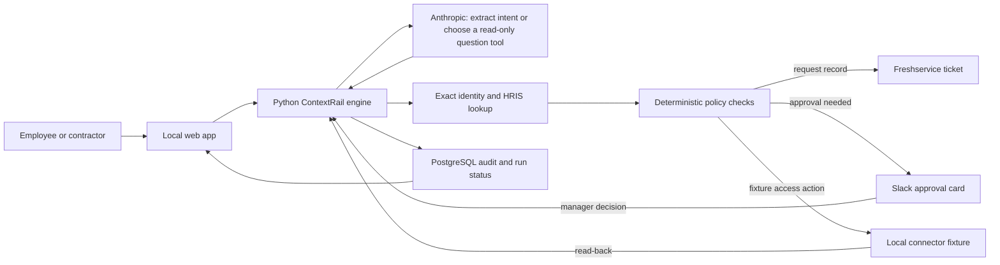

# ContextRail

**A local demo that turns a plain-language access request into a Freshservice ticket, a policy-checked plan, an approval, and a verifiable record.**

## What it is

ContextRail is a governed request workflow for employee and contractor access. A person asks in one sentence; a manager can review pending work from a separate persona and approve through Slack. The demo keeps the request simple while showing the decision and next step.

The local app has three personas: **Anil Kumar** (employee/requester), **Priya Raghunathan** (contractor/requester), and **Dana Osei** (manager/approver). They are fictional records used by the demo. Freshservice is the ticket system. The Python engine stores the workflow and its audit trail in a temporary local PostgreSQL database.

### Business objective

Replace scattered access requests and approvals with one traceable case: identify the exact person and target, apply written policy consistently, route exceptions to a named approver, create or update the help-desk ticket, and verify each permitted change before calling it complete.

### In scope

- Local browser demo with employee, contractor, and manager views.
- Plain-language request intake and clarification when a person is ambiguous.
- Freshservice ticket creation and read-back for the web request path.
- Policy outcomes shown as allowed, awaiting approval, or refused.
- Slack approval delivery and decision handling.
- Fictional HRIS, entitlement, and access-system records for safe demonstrations.
- English, Hindi, and Tamil voice-service language support in the voice code.

### Out of scope

- Production deployment to AWS. The requested demo runs locally.
- Real account provisioning in GitHub, AWS, Slack, or other business systems. Those access connectors are fixtures in this demo.
- Payments, Freshdesk, Freshworks Freddy AI or Agent Studio integration, and Databricks.
- A completed phone conversation through Vobiz. Its current carrier route rejects the test destinations before they ring.

## How a request moves


```mermaid
flowchart LR
  U[Employee or contractor] --> W[Local web app]
  W --> E[Python ContextRail engine]
  E --> L[Anthropic: extract intent or choose a read-only question tool]
  L --> E
  E --> I[Exact identity and HRIS lookup]
  I --> P[Deterministic policy checks]
  P -->|request record| F[Freshservice ticket]
  P -->|approval needed| S[Slack approval card]
  S -->|manager decision| E
  P -->|fixture access action| X[Local connector fixture]
  X -->|read-back| E
  E --> A[PostgreSQL audit and run status]
  A --> W
```

Anthropic helps interpret the request and select bounded, read-only tools for questions. It does not decide policy, resolve a person to an account, approve a request, or grant access. Python code performs exact identity lookup and applies the policy rules. If model output does not pass validation, intent extraction can fall back to a deterministic parser; the run records which extractor it used. A verified fixture action is not a production access change.

## Three demo scenarios

The three scenarios below have live Freshservice tickets **#123, #124, and #126**, each read back from the tenant. A repeat Priya request created and read back ticket **#128**. Access-system actions remain fixture-only.

1. **Same access as a colleague** — “Give Anil the same access as Rahul Mehta.” Live Freshservice ticket **#123** was created and read back. A live Anthropic T1 call extracted `access.same_as_peer`; the engine resolved Anil Kumar and Rahul Mehta by exact HRIS records. The initial policy plan verified 15 fixture actions, held two for Dana and Meera, and refused one. Dana then approved the payments-core read through Slack; the live audit now shows 16 verified, one still awaiting, and one refused. Nothing was provisioned in a real access system.

2. **Contractor onboarding** — “Priya starts Monday, give her everything she needs.” Ticket **#124** initially showed one verified fixture action (`Slack #general`), one awaiting approval (read-only `northbeam/perception-sdk`), and one refusal (production credentials). Dana then approved the GitHub read through Slack; the latest audit shows two verified actions, none awaiting, and one refusal. The SOW runs through 2027-03-31 and excludes production credentials and customer data. A repeat ticket, **#128**, has zero new verified actions, one approval awaiting, and one refusal: it correctly omits `Slack #general` because ticket #124 already added it to Priya's holdings. An isolated probe of the updated intent extractor returns `llm:T1`, extracts the onboarding request, and resolves Priya Raghunathan (W-8841). The ticket-backed runs were made by a process that had not loaded this prompt update, so reload the engine before presenting this model behavior. No real GitHub or AWS permission changed.

3. **Ambiguous colleague name** — “Give Anil the same access as Rahul.” Live Freshservice ticket **#126** was created and read back. ContextRail pauses and asks which Rahul: Rahul Mehta (payments) or Rahul Verma (risk analytics). Picking Rahul Mehta by candidate ID `E-0007` resumes the same run; it does not silently guess. The resumed plan first showed three verified fixture actions, two approvals waiting, and one refusal. Dana approved the payments-core read action; the run then showed four verified, one still awaiting, and one refused.

## Integrations and current status

`LIVE` means an external API call or decision was observed. `FIXTURE` means the demo reads or writes fictional local records. A configured credential alone does not make a connector live.

| Service | Status in this demo | What it does here |
| --- | --- | --- |
| **Freshworks / Freshservice** | **LIVE — ticket path verified** | The local web scenarios created and read back tickets **#123, #124, #126, and #128** in workspace 12; the tenant showed them open. This is Freshservice only. Service-catalog listing returned `403` for the current key, so catalog-based requests are not verified. |
| **Freshworks / FDK** | **Code present; tenant install not verified** | A Freshservice ticket-sidebar app exists in `fdk-app/`. It is not part of the required local browser demo and has not been installed in the tenant. |
| **Freshworks / Freshdesk, Freddy AI, Agent Studio** | **Not integrated** | These products are not used by the current demo. ContextRail has its own bearer-protected MCP server; that is not a Freshworks MCP service. |
| **Anthropic Claude Haiku** | **LIVE — model call verified** | Direct Anthropic inference extracts intent and mentions and powers bounded read-only question handling. A same-text isolated probe after the prompt fix returned `llm:T1` and resolved Priya; the ticket-backed #124/#128 runs recorded heuristic fallback because their engine process had not loaded that update. Policy and access decisions stay in code. |
| **Slack** | **LIVE — approval click verified** | Slack Socket Mode delivered approval cards for #123 and #124; Dana clicked both, and each audit records the Slack decision and verified fixture action. Slash-command ticket intake is implemented, but a live workspace command is not yet verified. |
| **Sarvam** | **LIVE — speech components tested** | Speech-to-text and text-to-speech were exercised in English, Hindi, and Tamil. These tests were separate from a successful phone call. |
| **Vobiz** | **BLOCKED BY CARRIER ROUTE** | The API accepted outbound attempts, then the carrier returned `UNALLOCATED_NUMBER` before either destination rang. There was no answered call or phone conversation. |
| **GitHub, HRIS, entitlements, Slack evidence** | **FIXTURE** | Fictional identities, policy evidence, permissions, and read-back state drive the three access scenarios. They do not change real accounts. |
| **AWS / Bedrock / SSM** | **Not used for this demo** | AWS is not hosting the app. AWS entitlements in the policy examples are fixture data; no AWS access was granted. |
| **Dodo Payments** | **Planned for later** | The code is pinned to Dodo test mode. A checkout and usage-event flow has not been verified with a configured product/customer. |
| **Databricks** | **Not integrated or used** | No Databricks connector, workspace, SQL endpoint, or data was involved. |
| **Email / Amazon SES** | **Code present; live path unverified** | Signed decision links and SES delivery code exist, but no live end-to-end email approval was demonstrated. |
| **Microsoft Teams** | **Planned** | A working Teams bot and approval path are not claimed. |
| **ContextRail MCP server** | **Available in code** | The engine exposes its own Streamable HTTP MCP tools at `/mcp`. The browser persona demo calls the engine HTTP API directly. |

## Run the local demo

Use Python 3.12, [uv](https://docs.astral.sh/uv/), Node.js, and the ignored local `.env`. Keep the engine token on the server; never put it in browser code or commit `.env`.

Start the temporary engine and local PostgreSQL from the repository root:

```powershell
uv sync --project engine --group dev --frozen
uv run --project engine python scripts/voice-pilot-local.py --freshservice --slack --port 8000
```

`--freshservice` enables the configured Freshservice tenant for ticket creation; `--slack` starts the Socket Mode door for approval cards and slash-command intake. Both require their credentials in `.env`. Without `--freshservice`, Freshservice remains a fixture. The temporary database is deleted when the engine stops.

In another PowerShell terminal, start the browser app:

```powershell
$env:DEMO_ENGINE_URL = 'http://127.0.0.1:8000'
$env:ENGINE_TOKEN = '<the local engine token>'
npm ci
npm run dev -- --hostname 127.0.0.1
```

Open [http://127.0.0.1:3100/engine-demo](http://127.0.0.1:3100/engine-demo). Switch personas, submit one request, review its outcome, then view the manager’s approvals. When running with `--freshservice`, a new web request can create a real ticket in the configured tenant.

The sample data and access connectors are fixtures. Stopping the engine removes its temporary run history; the Freshservice ticket remains in the tenant. No AWS deployment is required for this demo.

## Project map

- [`engine/`](engine/) — Python API, identity and policy workflow, connectors, audit, and MCP server.
- [`src/app/engine-demo/`](src/app/engine-demo/) — local three-persona demo UI.
- [`fdk-app/`](fdk-app/) — Freshservice ticket-sidebar app source.
- [`voice/`](voice/) — Vobiz and Sarvam voice service.
- [`knowledge/`](knowledge/) — policies, system notes, and cited knowledge.
- [`docs/CHECKLIST.md`](docs/CHECKLIST.md) and [`docs/DECISIONS.md`](docs/DECISIONS.md) — task status and design record.

MIT licensed; see [LICENSE](LICENSE).
