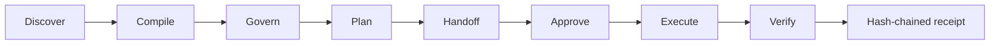

# ContextRail

**Ask for access in one sentence. ContextRail resolves the person, applies written policy, gets a named approval where needed, verifies permitted writes, and records an auditable receipt.**

ContextRail is a business process automation system built for **The Great Agent Hackathon, Track 2: Platform Agent Skills & Knowledge**. Freshservice is its ticket base. A Python engine carries one sealed case file through every stage; the model can extract intent and explain evidence, while code resolves identity, applies policy, checks approvals, and verifies outcomes.


## How the rail works


```mermaid
flowchart LR
  D[Discover] --> C[Compile]
  C --> G[Govern]
  G --> P[Plan]
  P --> H[Handoff]
  H --> A[Approve]
  A --> E[Execute]
  E --> V[Verify]
  V --> R[Hash-chained receipt]
```

Discover extracts intent and mentions; exact record lookup establishes the subject. Compile collects cited records and curated knowledge in a sealed case file. Govern returns **ALLOW**, **HOLD** for a named approver, or **REFUSE** with the deciding clause. Refused actions stay visible in the plan and cannot be approved into execution. Execute uses idempotency keys; Verify reads back connector state before calling an action complete. The PostgreSQL audit chain records the decisions and a printable receipt is available at `/r/{run_id}`. Writing that receipt back to a Freshservice ticket remains an integration task.

The engine in [`engine/`](engine/) is the decision and write authority: Python 3.12, FastAPI, PostgreSQL 16, Pydantic, a bounded Claude Haiku 4.5 router, deterministic policy rules, and LIVE/FIXTURE connectors. Its HTTP API, [MCP server](engine/contextrail/surfaces/mcp_server.py), and user doors call the same [door contract](engine/contextrail/surfaces/door.py). The [OKF bundle](knowledge/README.md) supplies curated knowledge; retrieved text is evidence, never an instruction or an identity source. The original [Next.js Command Center](src/app/) remains a separate Stage 1 fixture demonstration; its screens and metrics should not be read as evidence of a live tenant run.

## Five user doors

| Door | Repository state | External setup still needed |
| --- | --- | --- |
| **Freshservice** | REST connector, signed webhook intake, and FDK ticket sidebar are implemented. The configured tenant passed live, read-only `GET /api/v2/agents/me` and ticket-list checks. | The same key receives `403` listing service catalog items. Resolve that permission, then create the catalog item and signed Workflow Automator delivery path; verify ticket creation, approvals, and receipt notes end to end. |
| **Slack** | Slash command, status updates, approval cards, candidate picker, and Bolt handlers are implemented. | Install/configure the app and verify live Slack delivery. HTTP mode needs a signing secret; Socket Mode uses an app token. |
| **Email** | Freshservice mailbox intake classification, SES outbound mail, signed approval links, receipt mail, and SNS bounce handling are implemented. `GET` on a decision link only displays confirmation; `POST` decides. | Configure the support mailbox, SES sender and recipient permissions, and public links. Freshservice requester acknowledgement remains open. |
| **Microsoft Teams** | Identity fields and configuration are reserved. | Bot, Adaptive Cards, decision handler, and `ONE-WAY` Workflows fallback are planned; no working Teams door is claimed. |
| **Voice** | Vobiz/Sarvam service code covers request, status, curated knowledge, signed DTMF approval, and optional human transfer flows. A ticket number is spoken only after a Freshservice read-back. | Attach and test a number, credentials, public Answer URL, and human transfer number. No real call or ticket write has been verified. |

Other agents can use the engine's bearer-protected Streamable HTTP MCP endpoint at `/mcp`; the five user doors above are distinct from that agent interface. The root [`skills/`](skills/) directory contains Agent Skills. The FDK sidebar lives in [`fdk-app/`](fdk-app/).

The separate Stage 1 fixture MCP server in [`mcp/server.ts`](mcp/server.ts) registers six rail tools: `search_enterprise_knowledge`, `compile_context_capsule`, `check_policy_and_permissions`, `generate_action_plan`, `handoff_to_specialist`, and `execute_and_verify`. Its additional `list_runs` tool is read-only. That fixture ships twelve policy rules and five skills for agents; for example, `POL-CTR-001` denies production credentials for contractors. These counts describe the fixture catalog, not live Freshservice actions.

## Connector modes

`GET /v1/connectors` reports the runtime mode; configuration alone is not proof that an external transaction succeeded. Each receipt and door should preserve its reported mode.

| System | With local fixture data | With credentials/configuration |
| --- | --- | --- |
| Freshservice | `FIXTURE` ticket and requester state | `LIVE` REST path when `FS_DOMAIN` and `FS_API_KEY` are set. `agents/me` and ticket listing were verified; catalog listing returned `403`, and write flows remain unverified against the tenant. |
| HRIS, entitlements, GitHub, Slack evidence corpus | `FIXTURE` | No live connector in this build. |
| Slack door | No external delivery | Slack API delivery can run with its tokens; live app installation is not verified here. |
| Email door | No SES delivery | SES outbound can run with an authorized sender; inbound still depends on the Freshservice mailbox. |
| Teams door | Planned | Credentials alone do not create a bot or `ONE-WAY` fallback. |
| Voice door | Local service flows | Vobiz/Sarvam credentials, a number, public call routing, and a configured transfer destination require end-to-end verification. |
| Dodo Payments | `FIXTURE` | Any API path is pinned to **Dodo test mode**; no production payment claim. |
| LLM | Heuristic intent extraction or recorded replay | Configured direct Anthropic tiers, then optional Bedrock; policy and identity still stay in code. |

## Run locally

Docker Compose is the repository's one-box setup. It starts PostgreSQL, the engine, and Caddy; the voice service is opt-in. Docker and TLS behavior must be checked on the target machine. From the repository root:

```sh
cp .env.example .env
# Set ENGINE_TOKEN and DECISION_LINK_SECRET to distinct strong values in .env.
# Leave optional integration credentials empty for fixture-backed work.
docker compose build engine
docker compose up -d postgres
docker compose run --rm engine python -m contextrail.seed
docker compose up -d engine caddy
```

The engine health endpoint is `/health` behind Caddy at `https://localhost/health` with the default `CR_HOST=localhost`; Caddy uses a local certificate authority there. For a public host, set `CR_HOST`, `PUBLIC_URL`, DNS and credentials before exposing the service. The default Compose network does not publish PostgreSQL to the host. [`Makefile`](Makefile) provides `up`, `down`, `logs`, `migrate`, `seed`, `reset`, `lint`, and `test` targets where GNU Make is available. `seed` applies migrations and resets fixture connector state; it does not erase the audit database.

For an EC2 host, store the complete production `.env` as one SSM SecureString parameter and give the instance role `ssm:GetParameter` for that parameter and `kms:Decrypt` for its key. Then run `./scripts/ssm-env.sh /contextrail/prod/dotenv` on the host. The loader writes `.env` with mode `600` and leaves an existing file intact if retrieval or validation fails. Set `PUBLIC_URL=https://<public-host>` and `CR_HOST=<public-host>`; point DNS at the host and allow inbound 80/443 so Caddy can obtain TLS. Start the voice service explicitly with `docker compose --profile voice up -d --build`, verify `https://<public-host>/health` and `https://<public-host>/voice/health`, then configure Vobiz's Answer URL as `https://<public-host>/voice/answer`. A real phone call also requires an assigned Vobiz number and reachable callbacks. Do not infer call readiness from passing local tests.

For engine tests, install Python 3.12 and [uv](https://docs.astral.sh/uv/), then run:

```sh
uv sync --project engine --frozen
uv run --project engine pytest -q
```

The separate Stage 1 web demo runs with `npm ci && npm run dev` at `http://localhost:3100`; its fixture simulation is not the Python engine. Do not put API keys in the browser app or commit `.env`. See [`.env.example`](.env.example) for variable names, including `FS_DOMAIN` and `FS_API_KEY` for Freshservice.

## Integrations and project trail

The build uses Freshworks/Freshservice, Anthropic Claude, AWS PostgreSQL hosting/Bedrock/SES, Slack, Microsoft Teams, Vobiz × Sarvam, and Dodo Payments test mode at different levels of completion described above. Presence in this stack does not imply a deployed tenant or a verified external account.

Start with [`docs/CHECKLIST.md`](docs/CHECKLIST.md) for task IDs and acceptance state, then [`docs/DECISIONS.md`](docs/DECISIONS.md) for design choices and open questions. Git commits use `[T###]` headers plus `Task`, `Priority`, `Why`, `Verified`, and `Mode` trailers; a task's checklist box belongs in its implementation commit. [`docs/BUILDLOG.md`](docs/BUILDLOG.md) maps tasks to commits. Section branches are merged with merge commits so the task-level history stays readable; see [CLAUDE.md §24](CLAUDE.md) for the exact format. The older [Stage 1 submission](docs/SUBMISSION.md) and [storyboard](public/storyboard.html) document the prototype, not current live connector status.

MIT licensed; see [LICENSE](LICENSE).
